This topic doesn't have much to do with nicer code, but there is
probably some overlap in interest. However, some of the topics that
we cover arise naturally here, so read on!  We'll flesh out
sections that use interesting programming techniques (especially
higher order functions) over time.

# What is MCMC and when would you use it?

MCMC is simply an algorithm for sampling from a distribution.

It's only one of many algorithms for doing so.  The term stands for
"Markov Chain Monte Carlo", because it is a type of "Monte Carlo"
(i.e., a random) method that uses "Markov chains" (we'll discuss
these later).  MCMC is just one type of Monte Carlo method,
although it is possible to view many other commonly used methods as
simply special cases of MCMC.

As the above paragraph shows, there is a bootstrapping problem with
this topic, that we will slowly resolve.

## Why would I want to sample from a distribution?

You may not realise you want to (and really, you may not actually
want to).  However, sampling from a distribution turns out to be
the easiest way of solving some problems.  In MCMC's use in
statistics, sampling from a distribution is simply a means to an
end.

Probably the most common way that MCMC is used is to draw samples
from the **posterior probability distribution** of some model in
Bayesian inference.  With these samples, you can then ask things
like "what is the mean and credibility interval for a parameter?".

For example, suppose that you have fit a model where the posterior
probability density is some function $f$ of parameters $(x, y)$.
Then, to compute the mean value of parameter $x$, you would compute

$$
\bar x = \iint\! x f(x, y)\,\mathrm{d} x\,\mathrm{d} y
$$

which you can read simply as "the value of $x$ multiplied by the
probability of parameters $(x, y)$, integrated over all possible
values that $x$ and $y$ could take.


An alternative way to compute this value is simulate $k$
observations, $[(x,y)^{(1)}, \ldots, (x,y)^{(k)}]$, from $f(x,y)$
and compute the sample mean as

$$\bar x \approx \frac{1}{k} \sum_j x^{(j)}$$

where $x^{(j)}$ is the the $x$ value from the $j$th sample.

If these samples are independent samples from the distribution, then
as $k \to \infty$ the estimated mean of $x$ will converge on the true
mean.

Suppose that our target distribution is a normal distribution with
mean `m` and standard deviation `s`.  Obviously the mean of this
distribution is `m`, but let's try to show that by drawing samples
from the distribution.

As an example, consider estimating the mean of a normal
distribution with mean `m` and standard deviation `s` (here, I'm
just going to use parameters corresponding to a standard normal):

```r
m <- 0
s <- 1
```

We can easily sample from this distribution using the `rnorm`
function:

```r
set.seed(1)
samples <- rnorm(10000, m, s)
```

The mean of the samples is very close to the true mean (zero):

```r
mean(samples)
```

```
## [1] -0.006537
```

In fact, in this case, the expected variance of the estimate with
$n$ samples is $1/n$, so we'd expect most values to lie within $\pm
2\, / \sqrt{n} = 0.02$ of the true mean for 10,000 points.

```r
summary(replicate(1000, mean(rnorm(10000, m, s))))
```

```
##     Min.  1st Qu.   Median     Mean  3rd Qu.     Max. 
## -0.03250 -0.00580  0.00046  0.00042  0.00673  0.03550
```

This function computes the cumulative mean (that is, for element
$k$, the sum of elements $1, 2, \ldots, k$ divided by $k$).

```r
cummean <- function(x)
    cumsum(x) / seq_along(x)
```

Here is the convergence towards the true mean (red line at 0).

```r
plot(cummean(samples), type="l", xlab="Sample", ylab="Cumulative mean",
     panel.first=abline(h=0, col="red"), las=1)
```

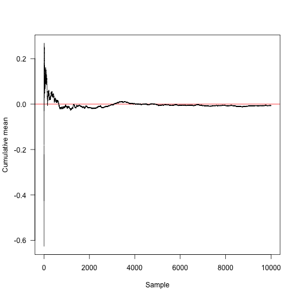

Transforming the x axis onto a log scale and showing another 30
random approaches:

```r
set.seed(1)
plot(cummean(samples), type="l", xlab="Sample", ylab="Cumulative mean",
     panel.first=abline(h=0, col="red"), las=1, log="x")
for (i in seq_len(30))
    lines(cummean(rnorm(10000, m, s)),
          col=rgb(runif(1), runif(1), runif(1), .5))
```

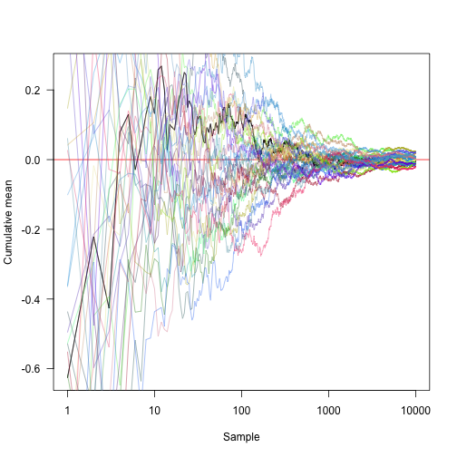

How does this work?  Consider the integral

$$
\int_a^b h(x) \mathrm{d} x
$$

If this can be decomposed into the product of a function $f(x)$ and a
probability density function $p(x)$, then

$$
\int_a^b h(x) \mathrm{d} x = \int_a^b f(x)p(x) \mathrm{d} x
$$

Note that the right hand side is simply the expectation $E[f(x)]$.
By the Law of Large Numbers, the expected value is the limit of the
sample mean as the sample size grows to infinity.  So we can
approximate $E[f(x)]$ as

$$
\frac{1}{n}\sum_{i=1}^n f(x_i).
$$

You can do lots of similar things with this approach.  For example,
if you want to draw a 95\% credibility interval around the estimate
$\bar x$, you could estimate the bottom component of that by
solving

$$
0.025 = \int_{-\infty}^a\int_{-\infty}^{\infty}\! x f(x, y)\,\mathrm{d} y\,\mathrm{d} x
$$

for $a$.  Or, you can just take the sample quantile from your
series of sampled points.

This is the analytically computed point where 2.5\% of the
probability density is below:

```r
p <- 0.025
a.true <- qnorm(p, m, s)
a.true
```

```
## [1] -1.96
```

We can estimate this by direct integration in this case (using the
argument above)

```r
f <- function(x) dnorm(x, m, s)
g <- function(a)
    integrate(f, -Inf, a)$value
a.int <- uniroot(function(x) g(x) - p, c(-10, 0))$root
a.int
```

```
## [1] -1.96
```

And estimate the point by Monte Carlo integration:

```r
a.mc <- unname(quantile(samples, p))
a.mc
```

```
## [1] -2.023
```

Note that this has an error around it:

```r
a.true - a.mc
```

```
## [1] 0.06329
```

But in the limit as the sample size goes to infinity, this will
converge.  Furthermore, it is possible to make statements about the
nature of the error; if we repeat sampling process 100 times, we
get a series of estimate that have error on around the same order
of magnitide as the error around the mean:

```r
a.mc <- replicate(100, quantile(rnorm(10000, m, s), p))
summary(a.true - a.mc)
```

```
##     Min.  1st Qu.   Median     Mean  3rd Qu.     Max. 
## -0.05840 -0.01640 -0.00572 -0.00024  0.01400  0.07880
```

## Still not convinced?

This sort of thing is really common.  In most Bayesian inference
you have a posterior distribution that is a function of some
(potentially large) vector of parameters and you want to make
inferences about a subset of these parameters.  In a heirarchical
model, you might have a large number of random effect terms being
fitted, but you mostly want to make inferences about one parameter.
In a Bayesian framework you would compute the *marginal
distribution* of your parameter of interest over all the other
parameters (this is what we were trying to do above).  If you have
50 other parameters, this is a really hard integral!

To see why this is hard, consider the region of parameter space
that contains "interesting" parameter values: that is, parameter
values that have probabilities that are appreciably greater than
zero (these are the only regions that contribute meaningfully to
the integrals that we're interested in, so if we spend our time
doing a grid search and mostly hitting zeros then we'll be wasting
time).

For an illustration of the problem,

  * consider a circle of radius $r$ within a square with sides of
    length $2r$; the "interesting" region of space is $\pi r^2 / 4
    r^2 = \pi / 4$, so we'd have a good chance that a randomly
    selected point lies within the circle.
  * For a sphere with radius $r$ in a *cube* with sides of length
    $2r$, the volume of the sphere is $4/(3 \pi r^3)$ and the volume
    of the cube is $(2d)^3$, so $4/3 \pi / 8 \approx 52\%$ of the
    volume is "interesting"
  * As the dimensionality of the problem, $d$, increases (using a
    hypersphere in a hypercube) this ratio is
    $$\frac{\pi^{d/2}}{d2^{d-1}\Gamma(d/2)}$$

```r
d <- 2:10
plot(d, pi^(d/2) / (d * 2^(d-1) * gamma(d/2)), log="y", las=1,
     xlab="Dimension",
     ylab="Proportion of hypercube filled with hypersphere")
```

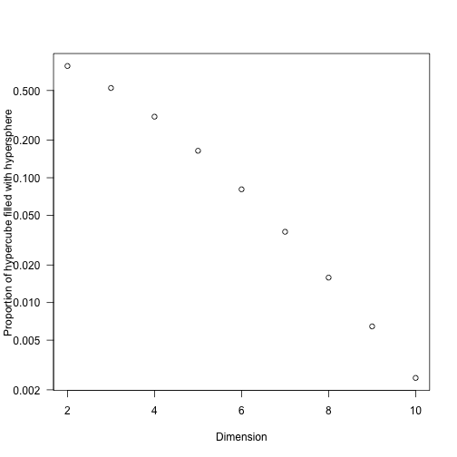

So we don't need to add many dimensions to be primarily interested
in a very small fraction of the potential space.  (It's also worth
remembering that most integrals that converge must be zero almost
everywhere or have a naturally very constrained domain.)

As a less abstract idea, consider a multivariate normal
distribution with zero covariance terms, a mean at the origin, and
unit variances.  These have a distinct mode (maximum) at the
origin, and the *ratio* of probabilities at a point and at the mode
is

$$\exp(-\sum_{i=1, d} x_i^2)$$

The thing about this function is that *any* large value of $x_i$
will cause the probability to be low.  So as the dimension of the
problem increases, the interesting space gets very small.  Consider
sampling within the region $-5 < x_i < 5$, and count how many of
10,000  sampled points have a relative probability greater than
1/1000

```r
test <- function(d, x=5)
  exp(-sum(runif(d, -x, x)^2)) > 1/1000
f <- function(d, n)
  mean(replicate(n, test(d)))

d <- 1:10
data.frame(dimension=d, p.interesting=sapply(d, f, 10000))
```

```
##    dimension p.interesting
## 1          1        0.5219
## 2          2        0.2173
## 3          3        0.0739
## 4          4        0.0218
## 5          5        0.0070
## 6          6        0.0025
## 7          7        0.0006
## 8          8        0.0000
## 9          9        0.0000
## 10        10        0.0000
```

which drops off much like the hypersphere case.  Even by looking at
only 4-5 dimensions we're likely to waste a lot of time if we tried
to exhaustively integrate over parameter space.

## Why doesn't "normal statistics" use Monte Carlo methods?

For many problems in traditionally taught statistics, rather than
sampling from a distribution you **maximise or maximise a
function**.  So we'd take some function that describes the
likelihood and maximise it (maximum likelihood inference), or some
function that computes the sum of squares and minimise it.

The reasons for this difference are a little subtle, but boil down
to whether or not you feel that you could possibly put a
probability distribution over a parameter -- is it something you
could sample?  Fisher in particular had strong thoughts on this,
thoughts which are argued more recently by AWF Edwards in the book
"Likelihood".  To avoid having to sample from a distribution (or
really, to avoid the idea that one could draw samples from a
probability distribution of parameters), error estimates in
frequentist statistics tend to either be asymptotic large-data
estimates or perhaps based on the bootstrap.

However, the role played by Monte Carlo methods in Bayesian
statistics is the same as the optimisation routine in frequentist
statistics; it's simply the algorithm for doing the inference.  So
once you know basically what MCMC is doing, you can treat it like a
black box in the same way that most people treat their optimisation
routines as a black box.

# Markov Chain Monte Carlo

At this point, suppose that there is some target distribution that
we'd like to sample from, but that we cannot just draw independent
samples from like we did before.  There is a solution for doing this
using the Markov Chain Monte Carlo (MCMC).  First, we have to define
some things so that the next sentence makes sense: *What we're going
to do is try to construct a Markov chain that has our
hard-to-sample-from target distribution as its stationary
distribution*.

## Definitions

Let $X_t$ denote the value of some random variable at time $t$.  A
Markov chain generates a series of samples $[X0, X1, X2, \ldots, Xt]$
by starting at some point $X_0$, and then following a series
of stochastic steps.

Markov chains satisfy the *Markov property*.  The Markov property
is the stochastic process version of "what happens in Vegas stays
in Vegas"; basically it doesn't matter how you got to some state
$x$, the probability of transition out of $x$ is unchanged, or:

$$
\Pr(X_{t+1} = x | X_t = x_t, X_{t-1} = x_{t-1}, \ldots, X_0 = x_0) = \Pr(X_{t+1} = x | X_t = x_t)
$$

The transition from one step to the next is described by the
*transition kernel*, which can be described by the probability (or
for continuous variables the probability *density*) of a transition
from state $i$ to state $j$ as

$$
P(i \to j) = \Pr(X_{t+1} = j | X_t = i)
$$

Let $\pi_j(t) = \Pr(X_t = s_j)$ be the probability that the chain is in
state $j$ at time (step) $t$, and define $\vec\pi(t)$ be the vector of
probabilites over possible states.  Then, given $\vec\pi(t)$, we can
compute $\vec\pi(t+1)$ using the *Chapman-Kolmogorov* equation.

$$
\pi_i(t+1) = \sum_k \pi_k(t) \Pr(k \to i)
$$

that is; the probability that we were in state $k$ multiplied by the
probability of making the transition from $k$ to $i$, summed over all
possible source states $k$.  Using the book-keeping of linear algebra,
let $\mathbf{P}$ be the *probability transition matrix* -- the matrix
whose $i,j$th element is $P(i \to j)$, and rewrite the above equation
as

$$\vec\pi(t + 1) = \vec\pi(t)\mathbf{P}$$

Note that we can iterate this equation easily:

$$
\vec\pi(t+2) = \vec\pi(t+1)\mathbf{P}
$$
$$
\vec\pi(t+2) = \vec\pi(t)\mathbf{P}\mathbf{P}
$$
$$
\vec\pi(t+2) = \vec\pi(t)\mathbf{P}^2
$$

## Stationary distributions

If there is some vector $\vec\pi^*$ that satisfies

$$\vec\pi^* = \vec\pi^*\mathbf{P}$$

then $\vec\pi^*$ is the *stationary distribution* of this Markov
chain.  Intuitively, think of this as the eventual characteristic
set of states that the system will set in to; run for long enough
that the system has "forgotten" its initial state, then the $i$th
element of this vector is the probability that the system will be
in state $i$.

The Markov chain will have a stationary distribution if the process
is *irreducible* (every state is visitable from every other state)
and *aperiodic* (the number of steps between two visits of a state
is not a fixed integer multiple number of steps).

Mathematically, $\vec\pi^*$ is the left eigenvector assicated with
the eigenvalue = 1.

Here's a quick definition to make things more concrete (but note
that this has nothing to do with MCMC itself -- this is *just* to
think about Markov chains!).  Suppose that we have a three-state
Markov process.  Let `P` be the transition probability matrix for
the chain:

```r
P <- rbind(c(.5,  .25, .25),
           c(.2,  .1,  .7),
           c(.25, .25, .5))
P
```

```
##      [,1] [,2] [,3]
## [1,] 0.50 0.25 0.25
## [2,] 0.20 0.10 0.70
## [3,] 0.25 0.25 0.50
```

note that the rows of `P` sum to one:

```r
rowSums(P)
```

```
## [1] 1 1 1
```

This can be interpreted as saying that we must go *somewhere*, even
if that place is the same place.  The entry `P[i,j]` gives the
probability of moving from state `i` to state `j` (so this is the
$P(i\to j)$ mentioned above.

Note that unlike the rows, the columns do not necessarily sum to 1:

```r
colSums(P)
```

```
## [1] 0.95 0.60 1.45
```

This function takes a state vector `x` (where `x[i]` is the
probability of being in state `i`) and iterates it by multiplying
by the transition matrix `P`, advancing the system for `n` steps.

```r
iterate.P <- function(x, P, n) {
    res <- matrix(NA, n+1, length(x))
    res[1,] <- x
    for (i in seq_len(n))
        res[i+1,] <- x <- x %*% P
    res
}
```

Starting with the system in state 1 (so `x` is the vector $[1,0,0]$
indicating that there is a 100\% probability of being in state 1
and no chance of being in any other state), and iterating for 10
steps:

```r
n <- 10
y1 <- iterate.P(c(1, 0, 0), P, n)
```

Similarly, for the other two possible starting states:

```r
y2 <- iterate.P(c(0, 1, 0), P, n)
y3 <- iterate.P(c(0, 0, 1), P, n)
```

This shows the convergence on the stationary distribution.

```r
matplot(0:n, y1, type="l", lty=1, xlab="Step", ylab="y", las=1)
matlines(0:n, y2, lty=2)
matlines(0:n, y3, lty=3)
```

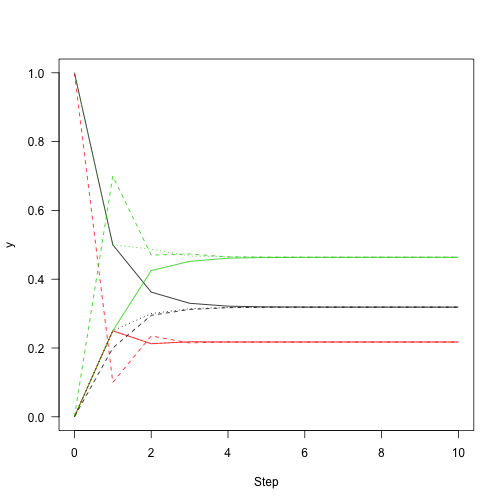

which means that regardless of the starting distribution, there is
a 32\% chance of the chain being in state 1 after about 10 or more
iterations *regardless of where it started*.  So, knowing about the
state of this chain at one point in time gives you information
about where it is likely to be for only a few steps.

We can use R's `eigen` function to extract the leading eigenvector
for the syste (the `t()` here transposes the matrix so that we get
the *left* eigenvector).

```r
v <- eigen(t(P), FALSE)$vectors[,1]
v <- v/sum(v) # normalise eigenvector
```

Then add points to the figure from before showing how close we are
to convergence:

```r
matplot(0:n, y1, type="l", lty=1, xlab="Step", ylab="y", las=1)
matlines(0:n, y2, lty=2)
matlines(0:n, y3, lty=3)
points(rep(10, 3), v, col=1:3)
```

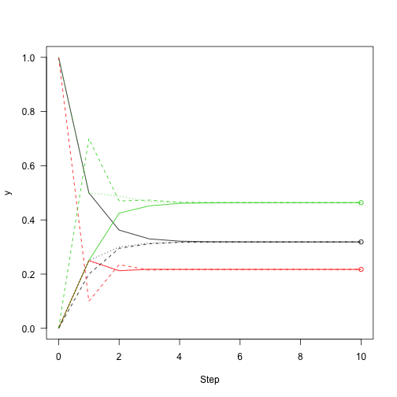

Following the definition of eigenvectors, multiplying the
eigenvector by the transition matrix returns the eigenvector
itself:

```r
drop(v %*% P) - v
```

```
## [1] -1.110e-16  1.388e-16  0.000e+00
```
(strictly, this should be the eigenvalue multiplied by `v`, but the
leading eigenvalue is always 1 for these matrices).

The proceedure above iterated the overall probabilities of
different states; not the actual transitions through the system.
So, let's iterate the system, rather than the probability vector.
The function `run` here takes a state (this time, just an integer
indicating which of the states $1, 2, 3$ the system is in), the
same transition matrix as above, and a number of steps to run.
Each step, it looks at the possible places that it could transition
to and chooses 1 (this uses R's `sample` function).

```r
run <- function(i, P, n) {
    res <- integer(n)
    for (t in seq_len(n))
        res[[t]] <- i <- sample(nrow(P), 1, pr=P[i,])
    res
}
```

Here's the chain running around for 100 steps:

```r
samples <- run(1, P, 100)
plot(samples, type="s", xlab="Step", ylab="State", las=1)
```

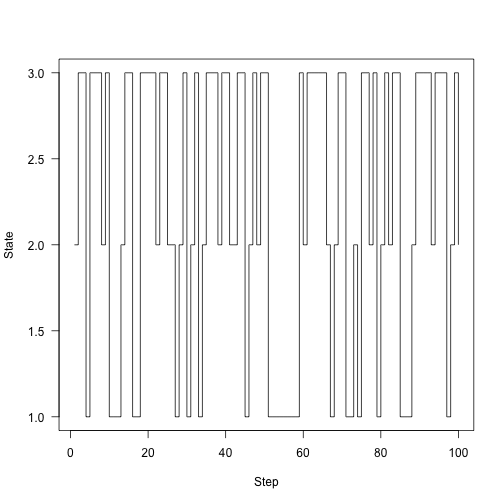

Rather than plotting state, plot the fraction of time that we were
in each state over time:

```r
plot(cummean(samples == 1), type="l", ylim=c(0, 1),
     xlab="Step", ylab="y", las=1)
lines(cummean(samples == 2), col=2)
lines(cummean(samples == 3), col=3)
```

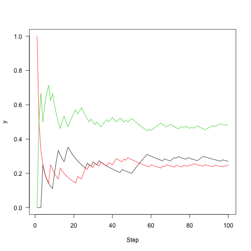

Run this out a little longer (5,000 steps)

```r
n <- 5000
set.seed(1)
samples <- run(1, P, n)
plot(cummean(samples == 1), type="l", ylim=c(0, 1), log="x",
     xlab="Step", ylab="y", las=1)
lines(cummean(samples == 2), col=2)
lines(cummean(samples == 3), col=3)
abline(h=v, lty=2, col=1:3)
```

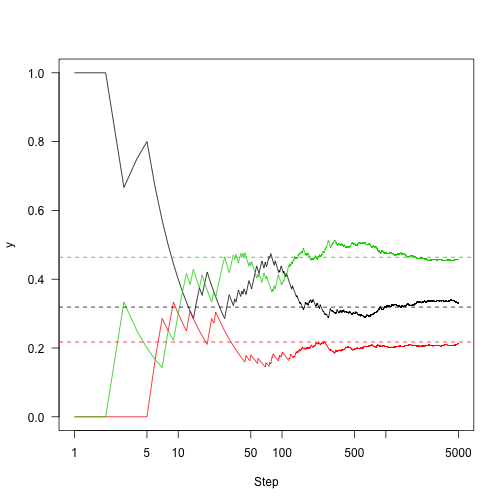

A sufficient (but not necessary) condition for the existance of a
stationary distribution is Detailed Balance, which says:

$$P(j \to k) \pi_j^* = P(k \to j) \pi_k^*$$

This imples that the chain is *reversible*.  The reason why this
condition implies that a stationary distribution exists is that it
implies

$$\vec\pi^* = \vec\pi^*\mathbf{P}$$

Summing both sides of the detailed balance equation over states $j$

$$\sum_j P(j \to k) \pi_j^* = \sum_j P(k \to j) \pi_k^*$$

The term on the left is equal to the $k$th element of
$\vec\pi^*\mathbf{P}$ and the term on the right can be factored:

$$\sum_j P(k \to j) \pi_k^* = \pi_k^* \sum_j P(k \to j)$$

Then, because $\sum_j P(k \to j) = 1$ (because $P$ is a transition
probability function, by the law of total probability things go
*somewhere* with probability 1), so the right hand side is $\pi_k^*$,
so we have 

$$(\vec\pi^*\mathbf{P})_k = \pi_k^*$$

which holds for all $k$ so

$$\vec\pi^*\mathbf{P} = \vec\pi^*$$

So the key point here is: Markov chains are neat and well
understood things, with some nice properties.  Markov chains have
stationary distributions, and if we run them for long enough we can
just look at the where the chain is spending its time and get a
reasonable estimate of that stationary distribution.

## The Metropolis algorithm

This is the simplest MCMC algorithm.  This section is not intended
to show how to design efficient MCMC samplers, but just to see that
they do in fact work.  What we're going to do is have some
distribution that we want to sample from, and we're going to be
able to evaluate some function $f(x)$ that is *proportional* to the
probability density of the target distribution (that is, if $p(x)$
is the probability density function itself, $f(x) \propto p(x)$,
i.e., $f(x) = p(x) / Z$, where $Z = \int f(x) \mathrm{d} x$).  Note
that $x$ might be a vector or a scalar.

We also need a probability density function $P$ that we *can* draw
samples from.  For the simplest algorithm, this **proposal**
distribution is symmetric, that is $P(x\to x^\prime) = P(x^\prime \to
x)$.

The algorithm proceeds as follows.

1. Start in some state $x_t$.
2. Propose a new state $x^\prime$
3. Compute the "acceptance probability"
$$\alpha = \min\left[1, \frac{f(x^\prime)}{f(x)}\right]$$
4. Draw some uniformly distributed random number $u$ from $[0,1]$; if
$u < \alpha$ accept the point, setting $x_{t+1} = x^\prime$.
Otherwise reject it and set $x_{t+1} = x_t$.

Note that in step 3 above, the unknown normalising constant drops out
because

$$\frac{p(x^\prime)}{p(x)} = \frac{f(x^\prime)}{Z} \frac{Z}{f(x)} =
\frac{f(x^\prime)}{f(x)}$$

This will generate a series of samples $\{x_0, x_1, \ldots\}$.  Note
that where the proposed sample is rejected, the same *value* will be
present in consecutive samples.

Note also that these are not independent samples from the target
distribution; they are *dependent samples*; that is, sample $x_t$
depends on $x_{t-1}$ and so on.  However, because the chain
approaches a stationary distribution, this dependence will not
matter so long as we sample enough points.

## MCMC sampling in 1d (single parameter) problems

Here is a target distribution to sample from.  It's the weighted sum
of two normal distributions.  This sort of distribution is fairly
straightforward to sample from, but let's draw samples with MCMC.  The
probability density function is

$$
f(x) = \frac{1}{z}
p \frac{\exp(x - \mu_1)^2}{2 \sigma_1^2} +
(1-p) \frac{\exp(x - \mu_2)^2}{2 \sigma_2^2}
$$

This is a contrived example, but distributions like this are not
totally impossible, and might arise when sampling things from a
mixture (such as human heights, which are bimodal due to sexual
dimorphism).

Fairly arbitrarily, here are some parameters and the definition of
the target density.

```r
p <- 0.4
mu <- c(-1, 2)
sd <- c(.5, 2)
f <- function(x)
    p     * dnorm(x, mu[1], sd[1]) +
    (1-p) * dnorm(x, mu[2], sd[2])
```

Here is the probability density plotted over the "important" part
of the domain (in general, this may not even be known!)

```r
curve(f(x), col="red", -4, 8, n=301, las=1)
```

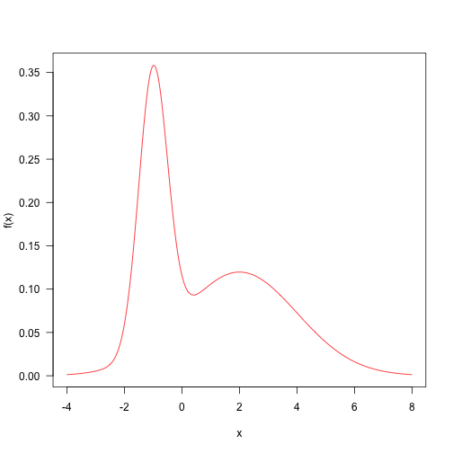

Let's define a really simple minded proposal algorithm that samples
from a normal distribution centred on the current point with a
standard deviation of 4

```r
q <- function(x) rnorm(1, x, 4)
```

This implements the core algorithm, as described above:

```r
step <- function(x, f, q) {
    ## Pick new point
    xp <- q(x)
    ## Acceptance probability:
    alpha <- min(1, f(xp) / f(x))
    ## Accept new point with probability alpha:
    if (runif(1) < alpha)
        x <- xp
    ## Returning the point:
    x
}
```

And this just takes care of running the MCMC for a number of steps.
It will start at point `x` return a matrix with `nsteps` rows and
the same number of columns as `x` has elements.  If run on scalar
`x` it will return a vector.

```r
run <- function(x, f, q, nsteps) {
    res <- matrix(NA, nsteps, length(x))
    for (i in seq_len(nsteps))
        res[i,] <- x <- step(x, f, q)
    drop(res)
}
```

We pick a place to start (how about -10, just to pick a really poor
point)

```r
res <- run(-10, f, q, 1000)
```
                
Here are the first 1000 steps of the Markov chain, with the target
density on the right:

```r
layout(matrix(c(1, 2), 1, 2), widths=c(4, 1))
par(mar=c(4.1, .5, .5, .5), oma=c(0, 4.1, 0, 0))
plot(res, type="s", xpd=NA, ylab="Parameter", xlab="Sample", las=1)
usr <- par("usr")
xx <- seq(usr[3], usr[4], length=301)
plot(f(xx), xx, type="l", yaxs="i", axes=FALSE, xlab="")
```

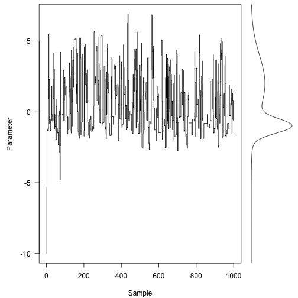

Even with only a thousand (non-independent) samples, we're starting
to resemble the target distribution fairly well.

```r
hist(res, 50, freq=FALSE, main="", ylim=c(0, .4), las=1,
     xlab="x", ylab="Probability density")
z <- integrate(f, -Inf, Inf)$value
curve(f(x) / z, add=TRUE, col="red", n=200)
```

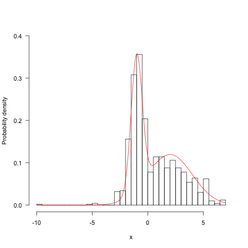

Run for longer and things start looking a bunch better:

```r
set.seed(1)
res.long <- run(-10, f, q, 50000)
hist(res.long, 100, freq=FALSE, main="", ylim=c(0, .4), las=1,
     xlab="x", ylab="Probability density", col="grey")
z <- integrate(f, -Inf, Inf)$value
curve(f(x) / z, add=TRUE, col="red", n=200)
```

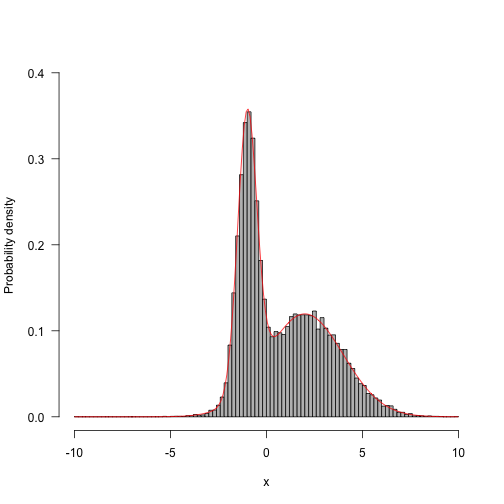

Now, run with different proposal mechanisms - one with a very wide
standard deviation (33 units) and the other with a very small
standard deviation (3 units).

```r
res.fast <- run(-10, f, function(x) rnorm(1, x,  33), 1000)
res.slow <- run(-10, f, function(x) rnorm(1, x,  .3), 1000)
```

Here is the same plot as above -- note the different ways that the
three traces are moving around.

```r
layout(matrix(c(1, 2), 1, 2), widths=c(4, 1))
par(mar=c(4.1, .5, .5, .5), oma=c(0, 4.1, 0, 0))
plot(res, type="s", xpd=NA, ylab="Parameter", xlab="Sample", las=1,
     col="grey")
lines(res.fast, col="red")
lines(res.slow, col="blue")
plot(f(xx), xx, type="l", yaxs="i", axes=FALSE)
```

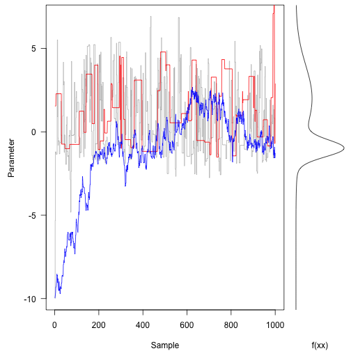

The original (grey line) trace is bouncing around quite freely.

In contrast, the red trace (large proposal moves) is suggesting
terrible spaces in probability space and rejecting most of them.
This means it tends to stay put for along time at once space.

The blue trace proposes small moves that tend to be accepted, but
it moves following a random walk for most of the trajectory.  It
takes hundreds of iterations to even reach the bulk of the
probability density.

You can see the effect of different proposal steps in the
autocorrelation among subsequent parameters -- these plots show the
decay in autocorrelation coefficient between steps of different
lags, with the blue lines indicating statistical independence.

```r
par(mfrow=c(1, 3), mar=c(4, 2, 3.5, .5))
acf(res.slow, las=1, main="Small steps")
acf(res, las=1, main="Intermediate")
acf(res.fast, las=1, main="Large steps")
```

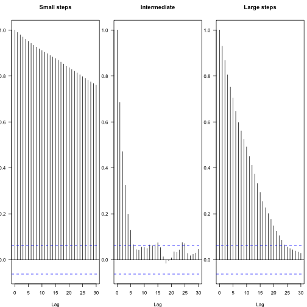

From this, one can calculate the effective number of independent
samples:

```r
coda::effectiveSize(res)
```

```
## var1 
##  187
```

```r
coda::effectiveSize(res.fast)
```

```
##  var1 
## 33.19
```

```r
coda::effectiveSize(res.slow)
```

```
##  var1 
## 5.378
```

The chains both "mix" worse than that first one.

This shows more clearly what happens as the chains are run for longer:

```r
n <- 10^(2:5)
samples <- lapply(n, function(n) run(-10, f, q, n))
xlim <- range(sapply(samples, range))
br <- seq(xlim[1], xlim[2], length=100)

hh <- lapply(samples, function(x) hist(x, br, plot=FALSE))
ylim <- c(0, max(f(xx)))
```

Showing 100, 1,000, 10,000 and 100,000 steps:

```r
par(mfrow=c(2,2), mar=rep(.5, 4), oma=c(4, 4, 0, 0))
for (h in hh) {
    plot(h, main="", freq=FALSE, yaxt="n",
         ylim=range(h$density, ylim))
    curve(f(x), add=TRUE, col="red", n=300)
}
```

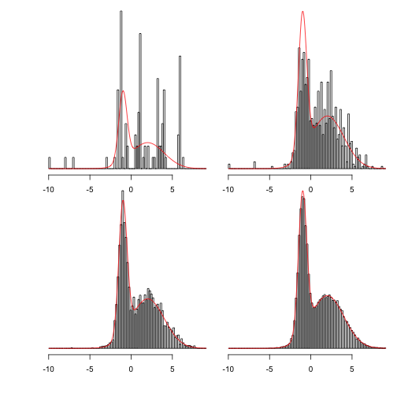

# MCMC In two dimensions

This is a function that makes a multivariate normal density given a
vector of means (centre of the distribution) and
variance-covariance matrix.

```r
make.mvn <- function(mean, vcv) {
  logdet <- as.numeric(determinant(vcv, TRUE)$modulus)
  tmp <- length(mean) * log(2 * pi) + logdet
  vcv.i <- solve(vcv)

  function(x) {
    dx <- x - mean
    exp(-(tmp + rowSums((dx %*% vcv.i) * dx))/2)
  }
}
```

As above, define the target density to be the sum of two mvns (this
time unweighted):

```r
mu1 <- c(-1, 1)
mu2 <- c(2, -2)
vcv1 <- matrix(c(1, .25, .25, 1.5), 2, 2)
vcv2 <- matrix(c(2, -.5, -.5, 2), 2, 2)
f1 <- make.mvn(mu1, vcv1)
f2 <- make.mvn(mu2, vcv2)
f <- function(x)
    f1(x) + f2(x)

x <- seq(-5, 6, length=71)
y <- seq(-7, 6, length=61)
xy <- expand.grid(x=x, y=y)
z <- matrix(apply(as.matrix(xy), 1, f), length(x), length(y))

image(x, y, z, las=1)
contour(x, y, z, add=TRUE)
```

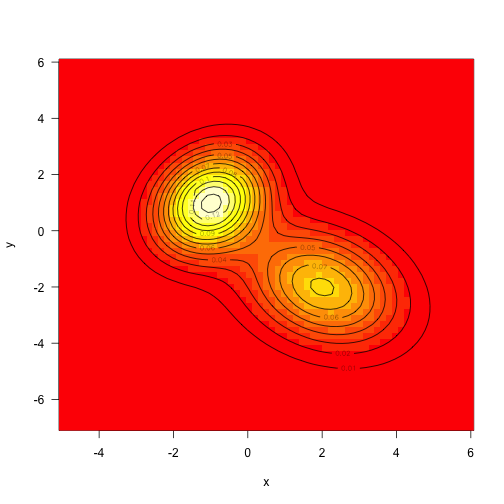

Sampling from multivariate normals is also fairly straightforward,
but we'll draw samples from this using MCMC.

There are a bunch of different strategies here -- we could propose
moves in both dimensions simultaneously, or we could sample along
each axis independently.  Both strategies will work, though they
will again differ in how rapidly they mix.

Assume that we don't actually know how to sample from a mvn (it's
not actually hard, but this is simpler), let's make a proposal
distribution that is uniform in two dimensions, sampling from the
square with width 'd' on each side.

```r
q <- function(x, d=8)
    x + runif(length(x), -d/2, d/2)

x0 <- c(-4, -4)
set.seed(1)
samples <- run(x0, f, q, 1000)

image(x, y, z, xlim=range(x, samples[,1]), ylim=range(x, samples[,2]))
contour(x, y, z, add=TRUE)
lines(samples[,1], samples[,2], col="#00000088")
```

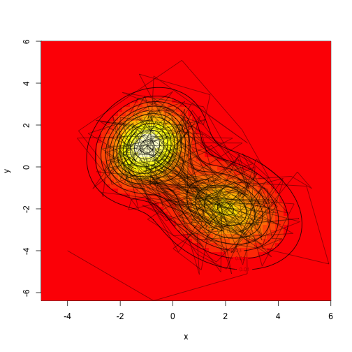

Drawing a ton of samples"

```r
set.seed(1)
samples <- run(x0, f, q, 100000)
```

Compare the sampled distribution against the known distribution:

```r
smoothScatter(samples)
contour(x, y, z, add=TRUE)
```

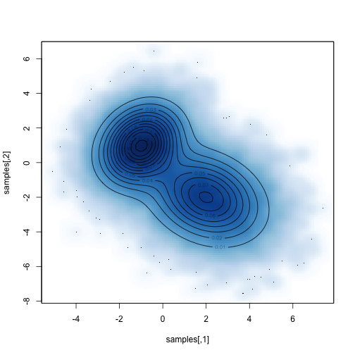


Then we can easily do things with the samples that are difficult to
do directly.  For example, what is the *marginal distribution* of
parameter 1:

```r
hist(samples[,1], freq=FALSE, main="", xlab="x",
     ylab="Probability density")
```

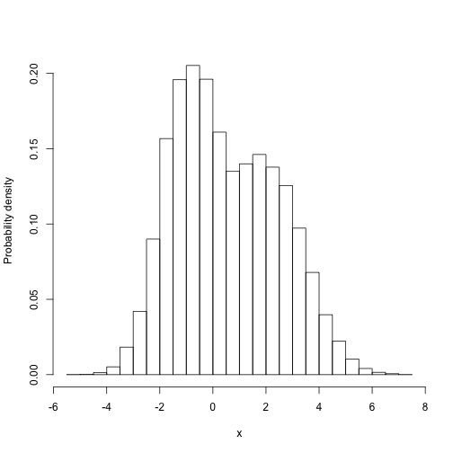

(this is the distribution that the first paramter takes, averaged
over all the possible values that the second parameter might take,
weighted by their probability).

Computing this properly is tricky - we need to integrate over all
possible values of the second parameter for each value of the
first.  Then, because the target function is not itself normalised,
we have to divide that through by the value of integrating over the
first dimension (this is the total area under the distribution).

```r
m <- function(x1) {
    g <- Vectorize(function(x2) f(c(x1, x2)))
    integrate(g, -Inf, Inf)$value
}

xx <- seq(min(samples[,1]), max(samples[,1]), length=201)
yy <- sapply(xx, m)
z <- integrate(splinefun(xx, yy), min(xx), max(xx))$value

hist(samples[,1], freq=FALSE, main="", las=1, xlab="x", 
     ylab="Probability density", ylim=c(0, 0.25))
lines(xx, yy/z, col="red")
```

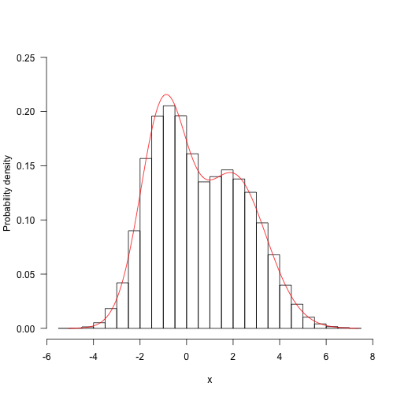
